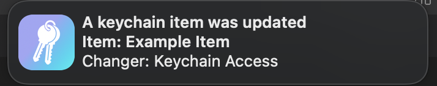

# Keeper of Keys: Looking out for your keychains

This is a small app for macOS which keeps an eye on your computer's keychains, reporting when a process touches an item inside one. Inspired by [BlockBlock](https://objective-see.org/products/blockblock.html), which does a similar thing monitoring for persistent software registrations.



## Setup and use

At some point, there will be CI built binaries available to download. Until then though, you'll need to compile the app from source.

### Building
1. Get a recent version of Rust. This project is only guaranteed to build with the most recent stable release.
2. Get `cargo-bundle`: `cargo install cargo-bundle`
3. Checkout the source: `git clone https://github.com/BlackHoleFox/keeper-of-keys`
4. Build the app: `cargo bundle --release`

### Running

1. Codesign the bundle (optional): `codesign -s "<id>" -o runtime "./target/release/bundle/osx/Keeper of Keys.app/"`
2. Install the app: `cp -r "./target/release/bundle/osx/Keeper of Keys.app" /Applications`
3. Start the app by double clicking it or starting it from the command line.
4. ~~profit~~ Enjoy seeing more of what your computer gets up to behind the curtains.

If you use Do Not Disturb mode a lot, consider adding the app to the list of apps which can bypass the block.

### Updating
When a new version comes out, updating is easy. Just follow the previous steps to get the new app bundle and replace the existing one. Start it once, and everything is good to go.

## Platform support
As implied by the name, the app only works on macOS. It should work on any version `10.7` or higher.

## Security tidbits
It has not been checked, but its reasonable to assume that a malicious (or misbehaving) piece of software could easily get around this in many ways, such as just killing the daemon and restarting it when the job is done.

As such, the usual disclaimers apply that I (or any contributors) are not responsible for what may happen while using this software.

The app is fully compatible with both the hardened runtime and sandboxing. By default, the `launchd` daemon will wrap itself in a sandbox before processing anything. The sandbox only allows the _bare minimum_ of operations for the app to correctly operate.

While the `unsafe` in this app has been checked, the sandboxing is meant to prevent any possible negative effects from either malicious exploitation or a bug in the source. Additionally, it is meant to provide extra transparency into what the app _can or could do_ while running in the background on your system.

If this is interesting, you can see [the sandbox profile](./resources/sandbox.sb) for more.

## Known limitations

- If a keychain item is changed by something that isn't a "user facing" application, no info is collected about the changer and a stub is used instead.
- If the item changed is not in the `login` keychain, no event data is received and no notification is generated for two reasons:
    - The daemon would need to run as `root` to receive events from the `System` keychain.
    - The `Local Items` keychain is not a real keychain. Instead, its special and [backed by iCloud](https://macmule.com/2014/03/30/the-local-items-keychain-in-mavericks/).
- Only supports generic and internet password item types.

## Logging

Ideally operation is smooth, but computers are bad. If things don't work, there are two options available:

- Run the app from a terminal and read the logs live:
    - `/Applications/Keeper\ of\ Keys.app/Contents/MacOS/keeper_of_keys` `<monitor>`
- Check the existing logs from a previous instance:
    - `open ~/Library/Containers/org.blackholefox.keeperofkeys/Data/Logs`

If the problem is too quite for the default `info` level,
try setting [`RUST_LOG`](https://docs.rs/flexi_logger/latest/flexi_logger/struct.Logger.html#method.try_with_env_or_str) to a more verbose level.

This can be set in a terminal if running from one, but can also be configured in the `launchd` agent. Simply open `~/Library/LaunchAgents/org.blackholefox.keeperofkeys.plist` in a text editor and add this snippet inside the top-level dictionary:

```xml
<key>EnvironmentVariables</key>
<dict>
	<key>RUST_LOG</key>
	<string>debug</string>
</dict>
```

## Other Examples

Discord:

